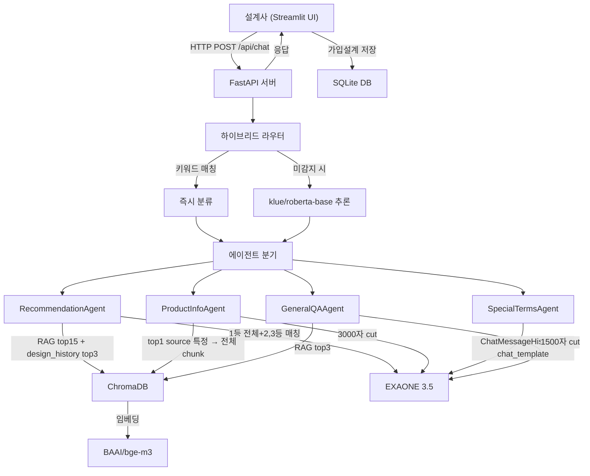

# 동양생명 가입설계 챗봇 — 프로젝트 구조 분석

> 보험 설계사가 고객 상황을 자연어로 입력하면, AI가 적합한 보험 상품을 추천하고 가입설계까지 자동화하는 내부 업무 지원 챗봇

---

## 디렉토리 트리

```
c:\insurance chatbot\
├── api_server.py            # FastAPI 백엔드 (메인 진입점, lifespan으로 모델 warm-up)
├── chatbot_ui.py            # Streamlit 프론트엔드 UI
├── router.py                # 하이브리드 라우터 (키워드 + roberta 분류)
├── ai_engine.py             # LLM(EXAONE 3.5) + 임베딩 + ChromaDB RAG
├── find_special.py          # ChromaDB '약관' 카테고리 청크 조회 디버그 유틸
│
├── agents/                  # 에이전트 (비즈니스 로직, __init__.py는 빈 파일)
│   ├── recommendation.py    #   상품 추천 에이전트
│   ├── product_info.py      #   상품 정보 조회 에이전트
│   ├── special_terms.py     #   특약 멀티턴 상담 에이전트
│   └── general_qa.py        #   일반 Q&A 에이전트
│
├── routes/                  # FastAPI 라우터 (API 엔드포인트 분리, __init__.py는 빈 파일)
│   ├── recommend.py         #   POST /api/recommend
│   ├── product_info.py      #   POST /api/product_info
│   ├── special_terms.py     #   POST /api/special_terms
│   └── general_qa.py        #   POST /api/general_qa
│
├── scripts/                 # 데이터 준비 & 학습 스크립트
│   ├── DB_setup.py          #   SQLite 테이블 생성 & 더미 데이터
│   ├── rag_pipeline.py      #   PDF → 청킹 → 임베딩 → ChromaDB 적재
│   ├── pdf_crawling.py      #   PDF 크롤링/다운로드
│   ├── router_finetune.py   #   klue/roberta-base 분류기 파인튜닝
│   ├── router_test.py       #   라우터 테스트
│   ├── data_gen.py          #   학습 데이터 생성
│   └── chromedb_view.py     #   ChromaDB 조회 유틸
│
├── utils/
│   └── pdf_generator.py     #   가입설계 결과 PDF 생성 (reportlab)
│
├── router_model/            # 파인튜닝된 klue/roberta-base 모델
│   ├── model.safetensors    #   (~442MB)
│   ├── config.json
│   ├── label_map.json       #   4-class 라벨 매핑
│   ├── tokenizer.json
│   └── tokenizer_config.json
│
├── chroma_db/               # ChromaDB 영구 저장소 (벡터 DB)
├── pdfs/                    # 보험 상품요약서 PDF 94개
├── insurance.db             # SQLite DB (설계사/고객/가입설계)
├── router_train.csv         # 라우터 학습 데이터
│
├── requirements.txt         # Python 의존성
├── Dockerfile               # Docker 컨테이너 빌드
├── docker-compose.yml       # 멀티 서비스 구성
├── 실행.bat                 # Windows 실행 배치 파일
└── PROJECT_SUMMARY.md       # 프로젝트 요약 문서
```

---

## 기술 스택

| 영역 | 기술 |
|------|------|
| **Backend** | FastAPI + Uvicorn |
| **Frontend** | Streamlit + httpx |
| **LLM** | EXAONE 3.5 2.4B Instruct (로컬 GPU, bfloat16, Flash Attention 2 우선 시도 후 fallback) |
| **임베딩** | BAAI/bge-m3 (SentenceTransformer, normalize_embeddings=True) |
| **라우터 분류** | klue/roberta-base 파인튜닝 (4-class, MAX_LEN=64, 클래스 가중치 손실) |
| **벡터 DB** | ChromaDB (insurance_products, design_history) |
| **관계형 DB** | SQLite (fc, customer, design_info 테이블) |
| **PDF 파싱** | pdfplumber (표 → 자연어 변환 포함) |
| **대화 이력** | langchain-community `ChatMessageHistory` (RunnableWithMessageHistory 미사용) |
| **인증** | JWT (PyJWT, HS256, 8시간 만료) |
| **PDF 생성** | reportlab (NanumGothic 한글 폰트) |

---

## 시스템 아키텍처



---

## 핵심 모듈 상세

### 1. `api_server.py` — FastAPI 백엔드
- **서버 기동 시** lifespan에서 ThreadPoolExecutor로 router + ai_engine 모델 사전 로딩 (warm-up)
- **주요 엔드포인트**:
  - `/api/chat` — 라우터 자동 분기 (Streamlit UI 메인 진입점)
  - `/api/recommend`, `/api/product_info`, `/api/special_terms`, `/api/general_qa` — 에이전트별 직접 호출
  - `/api/health`, `DELETE /api/session/{id}` — 상태 확인 / 세션 삭제
- **세션 관리**: `_sessions: dict[str, dict]` 딕셔너리에 session_id별 컨텍스트(current_source, current_intent, current_terms, chat_history) 보관

### 2. `router.py` — 하이브리드 라우터
- **1단계**: 키워드 매칭 → LLM 호출 없이 즉시 분류
- **2단계**: klue/roberta-base 파인튜닝 모델로 4-class 추론
- **Intent 4종**: `recommendation`, `product_info`, `special_terms`, `general_qa`
- **대화 연속 감지**: special_terms 진행 중 수정 요청은 intent 유지

### 3. `ai_engine.py` — AI 엔진
- **EXAONE 3.5 2.4B** 로컬 LLM (Flash Attention 2 우선 시도)
- **BAAI/bge-m3** 임베딩 모델 (ChromaDB 검색용)
- **ChromaDB**: `insurance_products` (상품 PDF 벡터), `design_history` (가입설계 이력)
- 주요 함수: `search_products()`, `search_history()`, `_get_full_chunks_by_source()`, `_run_llm()`

### 4. `chatbot_ui.py` — Streamlit UI
- **3개 화면**: 로그인 → 챗 서비스 → 가입설계
- JWT 기반 설계사 인증 (SQLite fc 테이블)
- API 서버(`/api/chat`)와 httpx로 통신
- intent별 응답 렌더링 (RAG 유사도 바, 특약 목록, 일반 답변 등)
- 가입설계 완료 시 SQLite 저장 + PDF 다운로드

### 5. `agents/` — 에이전트 모듈
| 에이전트 | 파일 | 역할 | 프롬프트 길이 |
|---------|------|------|------|
| RecommendationAgent | `recommendation.py` | RAG top15 → source 중복제거 3개 → **1등=전체 chunk(1000자), 2·3등=매칭 chunk 400자** + design_history top3 → EXAONE 추론 → 11개 필드 구조화 파싱 | ~2500자 |
| ProductInfoAgent | `product_info.py` | top1으로 source 특정 → 해당 PDF 전체 chunk 수집(3000자 cut) → EXAONE 정리 → 8개 필드 파싱 | ~3000자 |
| SpecialTermsAgent | `special_terms.py` | source 필터 RAG 5개(2000자 cut) + `ChatMessageHistory.messages`를 직접 messages 리스트로 변환 → EXAONE `apply_chat_template` 직접 호출 → `recommended` diff(added/removed) 계산 | ~2000자 |
| GeneralQAAgent | `general_qa.py` | RAG top3(1500자 cut) → EXAONE 답변 | ~1500자 |

### 6. `scripts/` — 데이터 파이프라인
| 스크립트 | 역할 |
|---------|------|
| `DB_setup.py` | SQLite 테이블 (fc, customer, design_info) 생성 + 더미 데이터 |
| `rag_pipeline.py` | PDF → pdfplumber 파싱 → 의미단위 청킹 → bge-m3 임베딩 → ChromaDB 적재 |
| `router_finetune.py` | klue/roberta-base 4-class 분류기 파인튜닝 |
| `data_gen.py` | 학습 데이터 자동 생성 |
| `pdf_crawling.py` | 보험 상품 PDF 크롤링 |

---

## 데이터 흐름

### RAG 파이프라인 (오프라인)
```
pdfs/ (94개 상품요약서)
  → pdfplumber 파싱
       · 표 영역 추출 → table_to_natural_language()로 "헤더: 값, ..." 자연어 변환
       · 표 외 영역 → outside_bbox()로 추출
  → 청킹 (chunk_text)
       · Q&A 패턴 우선 분리 → 항목기호(■·-·※/숫자)) → sentence fallback
       · 800자 초과 시 split_long_chunk(max=500, overlap=50)
       · 30자 미만 청크는 직전 청크에 병합
  → 메타데이터 태깅
       · 키워드 매칭으로 category 자동 분류 (보장내용/보험료/가입조건/면부책/갱신조건/약관/치아/일반)
       · {source, page, chunk_type, chunk_index, category, char_count}
  → BAAI/bge-m3 임베딩 (batch_size=32, normalize)
  → ChromaDB insurance_products 컬렉션 (cosine, ids="chunk_{n}")
```

### DB 초기 구성 (`scripts/DB_setup.py`)

#### SQLite (`insurance.db`)

**`fc` — 설계사 (5명 더미: FC001~FC005, password=1234)**
| 컬럼 | 타입 | 제약 |
|------|------|------|
| fc_id | TEXT | PRIMARY KEY |
| fc_name | TEXT | NOT NULL |
| password | TEXT | NOT NULL (평문 ⚠️) |
| branch | TEXT | |
| phone | TEXT | |
| created_at | TEXT | DEFAULT datetime('now','localtime') |

**`customer` — 고객 (10명 더미)**
| 컬럼 | 타입 | 제약 |
|------|------|------|
| customer_id | TEXT | PRIMARY KEY |
| name | TEXT | |
| gender | TEXT | |
| birth | TEXT | |
| phone | TEXT | |
| is_virtual | INTEGER | DEFAULT 0 |
| fc_id | TEXT | FK → fc.fc_id |
| created_at | TEXT | DEFAULT datetime('now','localtime') |

**`design_info` — 가입설계 (빈 테이블, 챗봇이 저장)**
| 컬럼 | 타입 | 제약 |
|------|------|------|
| design_no | TEXT | PRIMARY KEY (`DY-YYYYMMDDHHMMSS`) |
| customer_id | TEXT | FK → customer.customer_id |
| fc_id | TEXT | FK → fc.fc_id |
| product_name | TEXT | |
| product_group | TEXT | 생명/건강/연금/치아/암 |
| product_type | TEXT | 종신형/정기형/저축형/변액형 |
| payment_period | TEXT | 10년납/20년납/전기납 |
| insurance_period | TEXT | |
| payment_cycle | TEXT | 월납/분기납/연납 |
| amount | INTEGER | 만원 단위 |
| monthly_premium | INTEGER | 원 단위 |
| ai_accuracy | INTEGER | 0~100 |
| ai_reason | TEXT | |
| status | TEXT | DEFAULT '완료' |
| created_at | TEXT | DEFAULT datetime('now','localtime') |

> ⚠️ **특약 컬럼 부재** — `current_terms`(SpecialTermsAgent 결과)가 가입설계 저장 시 유실됨.

#### ChromaDB

**`insurance_products` 컬렉션 (RAG 파이프라인이 적재, ~수만 chunk)**
- 메타데이터: `source`(PDF 파일명), `page`, `chunk_type`(text/table), `chunk_index`, `category`(보장내용/보험료/가입조건/면부책/갱신조건/약관/치아/일반), `char_count`
- 거리 함수: cosine, ID 형식: `chunk_{n}`

**`design_history` 컬렉션 (가입설계 이력 50건 더미 + bge-m3 임베딩)**
- 더미 메타데이터: `gender`, `age`, `product`, `product_type`, `payment_period`, `payment_cycle`, `amount`, `premium`, `date`
- `save_design()` 호출 시 `design_no` 메타데이터 추가하여 저장 (SQLite `design_info` 와 동시 INSERT)
- 문서 형식: `"{gender} {age}세 고객이 {product}에 가입했습니다. 상품유형은 {product_type}이며, ..."`

### 실시간 추론 흐름
```
설계사 입력
  → 하이브리드 라우터 (키워드 → roberta)
  → Intent별 에이전트
  → ChromaDB 유사도 검색 + EXAONE 3.5 추론
  → 구조화된 JSON 응답
  → Streamlit UI 렌더링
  → (가입설계 확정 시) SQLite 저장 + PDF 생성
```

---

## 실행 방법

```bash
# 1. FastAPI 서버
uvicorn api_server:app --host 0.0.0.0 --port 8000 --reload

# 2. Streamlit UI (별도 터미널)
streamlit run chatbot_ui.py
```

또는 `실행.bat` 배치 파일 사용
